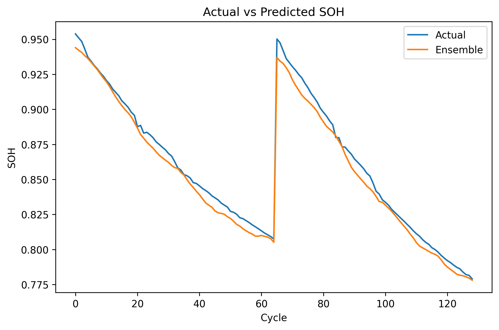

# 🔋 Battery State of Health (SOH) Prediction

This project predicts the State of Health (SOH) of lithium-ion batteries using machine learning and deep learning models.

---

  **Overview**

Battery degradation is a time-dependent process. This project models SOH using:

* Time-series deep learning (LSTM + GRU)
* Ensemble learning for improved accuracy
* Traditional ML (XGBoost) for comparison

---

  **Final Results**

| Model           | Test MAE   |
| --------------- | ---------- |
| LSTM Ensemble | **0.0058** |
| LSTM            | ~0.007     |
| XGBoost         | ~0.0086    |
| CNN             | ~0.010     |

---

## 📊 Sample Output



---

  Approach

 1️.) Data Processing

* Raw battery data (~1M rows) converted to **cycle-level features**
* Aggregation using statistical metrics:

* Mean, max, min, standard deviation
* Reduced dataset to ~366 rows (one per cycle)

---

 2️.) Feature Engineering

* Voltage statistics (mean, std, max, min)
* Temperature features
* Capacity and capacity fade
* Cycle number
* Normalized capacity

---

 3️.) Models Implemented

#### 🔹 LSTM-GRU Model

* Captures temporal dependencies
* Handles sequential degradation patterns

#### 🔹 LSTM Ensemble ⭐

* Trained multiple models
* Averaged predictions
* Reduced noise and improved stability

#### 🔹 CNN

* Used for temporal pattern extraction
* Less effective for long-term dependencies

#### 🔹 XGBoost

* Strong tabular baseline
* Lacks temporal awareness

---

## 🔑 Key Insights

* LSTM models outperform traditional ML for time-series battery data
* Ensemble learning significantly improves prediction stability
* Feature engineering plays a critical role in performance
* Tree-based models show local fluctuations due to lack of temporal context

---

## 📁 Repository Structure

```text
.
├── CNN.ipynb
├── LSTM GRU.ipynb
├── LSTM with ENSEMBLE.ipynb   ⭐ Final model
├── XGB.ipynb
├── train_final.csv
├── test_final.csv
├── soh_prediction_graph_final.png
└── README.md
```

---

## ⚙️ How to Run

1. Install dependencies:

```bash
pip install numpy pandas matplotlib scikit-learn tensorflow xgboost
```

2. Run notebooks in order:

* Data preprocessing notebooks
* Model training notebooks
* Ensemble notebook (final results)

---

## 📌 Notes

* Training and test data were processed separately but using identical feature engineering pipelines
* Scaling was applied using training data only to avoid data leakage
* Sequence length and hyperparameters were tuned experimentally

---

## 🎯 Future Work

* Deployment using TensorFlow Lite (TinyML)
* Real-time BMS integration
* Extension to robotics energy systems

---

## 👨‍💻 Author

**Rohansh Dattani**

---

## ⭐ If you found this useful, consider starring the repo!
